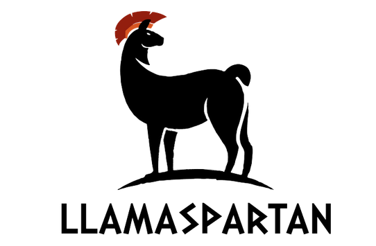
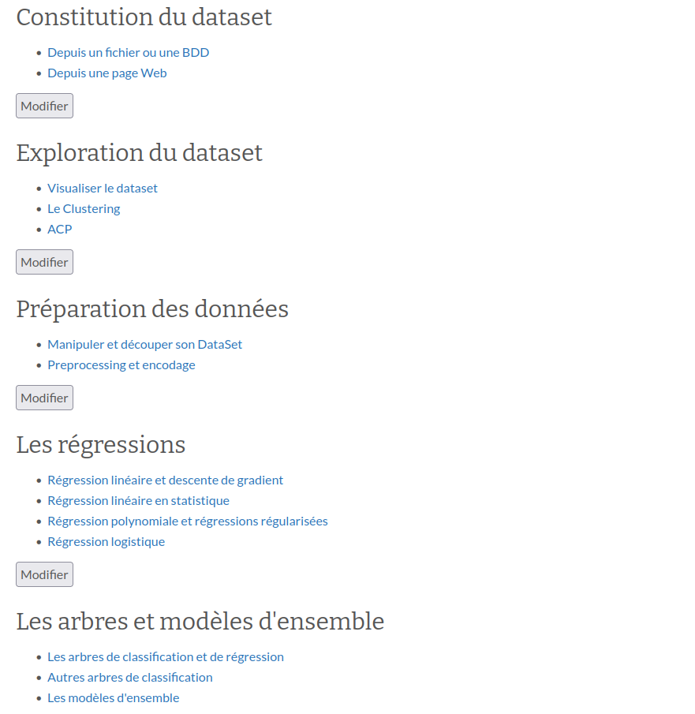
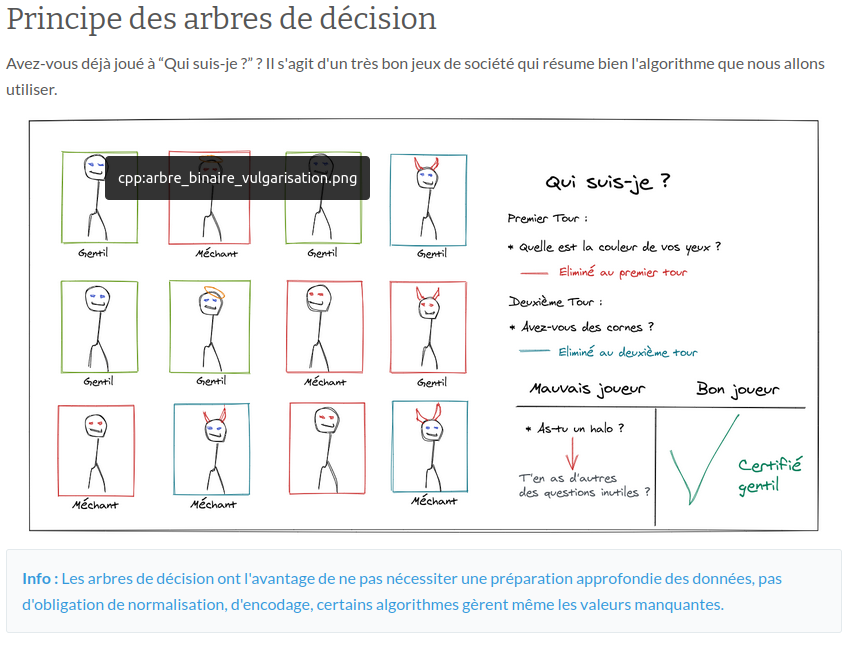

# Association Llama's Partan

En école d'ingénieurs, nous bénéficions de cours théoriques très complets, néanmoins, les technologies utilisées 
pour les illustrer sont rarement abordées en profondeur par manque de temps. Nous avons donc fait le choix d'écrire 
une documentation qui complète les enseignements qui nous sont donnés.

# Les sujets abordés

Le spectre des sujets abordés est large et nous avons pour le moment travailler plus spécifiquement sur les sujets autour
de l'IA.

# Illuster

La pédagogie utilisée dans cette documentation est voulue très imagée. Une introduction par l'exemple est toujours proposée
suivi de la théorie mathématiques synthétisée.

